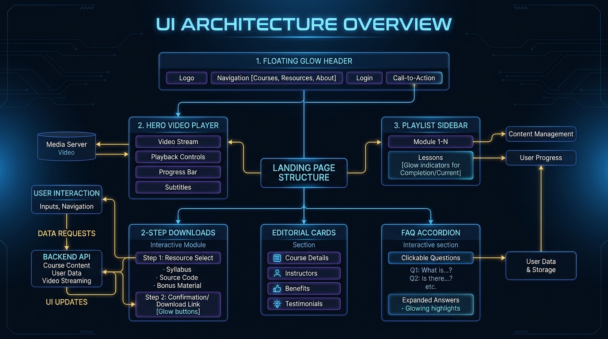
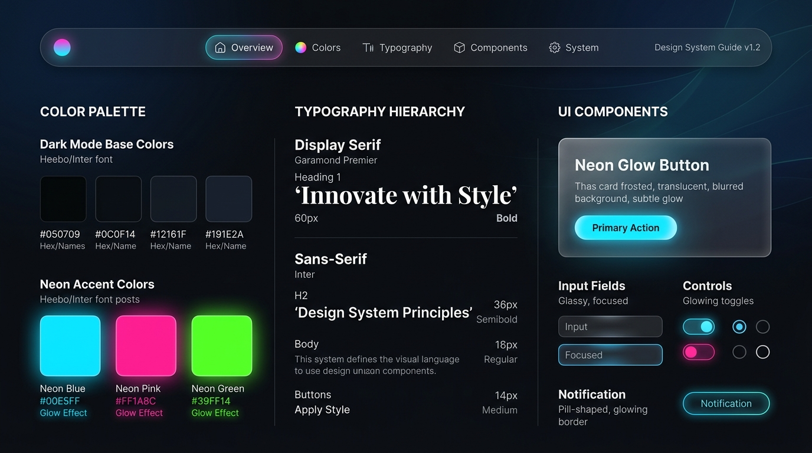

# 📘 Manual Completo de Replicação e Criação de Sites (Padrão Aurum / Landing Page Editorial)

Este manual descreve o passo a passo completo, a arquitetura, o design system, os componentes e os scripts necessários para criar e personalizar novos sites utilizando o mesmo padrão estético e funcional de alta conversão desta landing page.

---

## 📸 1. Visão Geral e Arquitetura do Sistema

O modelo é baseado em uma **Landing Page Editorial de Alto Padrão** focada em lançamentos de cursos, séries gratuitas de aulas e captação de leads. 

### Principais Características
* **Visual Dark de Luxo:** Fundo ultra-escuro (`#00000A`) com esferas flutuantes de iluminação ambiente (Glow effect) e gradientes sutis.
* **Header Cápsula Flutuante:** Barra superior com logo e CTA em formato de pílula com vidro fosco (glassmorphic backdrop blur).
* **Painel de Aulas Estilo Playlist (Classroom Grid):** Player principal integrado com lista lateral de aulas (liberadas ou bloqueadas por data em tempo real).
* **Cards Editoriais Numerados:** Exibição clara do conteúdo programmatico.
* **Seção de Próximos Passos (Dois Passos):** Destaque para download de materiais (PDF/E-book) e entrada em grupos de WhatsApp.
* **Sistema de Comentários Integrado:** Formulário que envia dados em tempo real para **Google Sheets** (via Google Apps Script) e banco KV de backup.
* **FAQ Interativo:** Accordion expansível e responsivo com ícones dinâmicos.
* **Animações de Entrada:** Título com revelação palavra por palavra e animação ao rolar a página (*Reveal on Scroll*).



---

## 📁 2. Estrutura Recomendada de Pastas

Para manter o projeto organizado e de fácil manutenção, utilize a seguinte estrutura de arquivos:

```text
meu-novo-site/
│
├── css/
│   ├── root.css           # Design tokens, variáveis de cor, tipografia e utilitários
│   ├── aurum.css          # Estilos específicos da landing page, grids e animações
│   └── home.css           # Estilos complementares (se necessário)
│
├── js/
│   ├── aurum.js           # Lógica principal (Playlist de vídeos, bloqueio por data, FAQ e envio do formulário)
│   └── anti-copy.js       # Script opcional para proteção contra cópia e inspeção
│
├── fonts/
│   ├── poppins-*.woff2    # Fontes principais em formato web otimizado
│   ├── syne-*.woff2
│   └── material-symbols-200.woff2 # Ícones Material Symbols
│
├── images/
│   ├── logo.png           # Logomarca do projeto
│   ├── thumb_aula1.webp   # Miniaturas dos vídeos (formato WebP otimizado)
│   ├── dr_especialista.jpg# Foto do especialista/professor
│   └── mockup_ebook.webp  # Imagem do e-book / material de apoio
│
├── MANUAL_CRIACAO_SITES.md # Este manual de instrução
└── index.html             # Arquivo HTML principal da página
```

---

## 🎨 3. Design System & Tokens de Estilo

O visual premium do site se baseia no uso rigoroso de variáveis CSS (*CSS Custom Properties*) declaradas no arquivo `css/root.css`.



### Principais Variáveis de Cores (`root.css`)
```css
:root {
  /* Cores Base Escuras */
  --bb: #00000A;              /* Fundo principal ultra-escuro */
  --dn700: #1E1E28;           /* Fundo de inputs e containers */
  --dn500: #32323C;           /* Elementos secundários / cards */
  --bw: #F5F5FF;              /* Texto principal quase branco */
  --bw-50: rgba(245,245,255,0.50); /* Texto secundário com transparência */
  --bw-15: rgba(245,245,255,0.15); /* Bordas discretas */

  /* Cores de Destaque / Accents */
  --pc500: #4B00FF;           /* Azul/Roxo vibrante de destaque */
  --pp300: #9664FF;           /* Roxo claro para iluminação */
  --sg500: #D7B491;           /* Tom dourado/champagne editorial */
  --sc500: #00FF96;           /* Verde de confirmação / sucesso */

  /* Tipografia */
  --font-family: "Poppins", sans-serif;
  --font-family-serif: "Cormorant Infant", serif;
  --font-family-vertical: "Oswald", sans-serif;
}
```

### Efeito de Esferas Ambientais Glow (CSS)
```css
.aurum-ambient-glow {
  position: absolute;
  border-radius: 50%;
  filter: blur(120px);
  pointer-events: none;
  z-index: 0;
}

.aurum-ambient-glow--1 {
  top: -100px;
  left: 50%;
  transform: translateX(-50%);
  width: 600px;
  height: 600px;
  background: radial-gradient(circle, rgba(75, 0, 255, 0.25) 0%, rgba(0, 0, 10, 0) 70%);
}

.aurum-ambient-glow--2 {
  top: 800px;
  right: 10%;
  width: 500px;
  height: 500px;
  background: radial-gradient(circle, rgba(150, 0, 255, 0.15) 0%, rgba(0, 0, 10, 0) 70%);
}
```

---

## 🏗️ 4. Guia de Construção do HTML (`index.html`)

A estrutura HTML é dividida em blocos bem definidos. Abaixo está a anatomia dos componentes principais:

### 4.1. Topbar e Header Cápsula
```html
<!-- Topbar de Aviso Superior -->
<div class="aurum-topbar" id="topbar">
  <div class="aurum-topbar-inner">
    <span class="aurum-topbar-badge">Série Gratuita</span>
    Aprenda o passo a passo completo. Participe do evento online.
  </div>
</div>

<!-- Header Cápsula Flutuante -->
<div class="aurum-header-container">
  <header class="aurum-header-pill">
    
    <a href="#inscricao" class="aurum-btn aurum-btn-accent">Inscrever-se</a>
  </header>
</div>
```

### 4.2. Hero com Player e Playlist Integrada
```html
<main class="aurum-hero">
  <div class="aurum-hero-content">
    <span class="aurum-hero-eyebrow">Série Gratuita de 3 Aulas</span>
    <h1 class="aurum-hero-h1">Título Impactante do seu Lançamento</h1>
    <p class="aurum-hero-p">Subtítulo explicativo detalhando o valor do evento e o aprendizado principal.</p>
  </div>

  <div class="aurum-classroom-container">
    <!-- Coluna Esquerda: Player de Vídeo -->
    <div class="aurum-classroom-main">
      <div class="aurum-classroom-player" id="player-section">
        <div class="aurum-video-lazy-placeholder" id="video-lazy-trigger" data-video-url="URL_DO_EMBED_DO_VIDEO">
          <div class="aurum-video-lazy-overlay"></div>
          <div class="aurum-play-btn-wrap">
            <div class="aurum-play-btn">▶</div>
          </div>
          
        </div>
      </div>
      <div class="aurum-classroom-meta">
        <span class="classroom-badge-active" id="active-badge">Aula 1</span>
        <span class="classroom-date-active" id="active-date">Disponível Agora</span>
        <h2 class="classroom-title-active" id="active-title">Nome da Aula 1</h2>
      </div>
    </div>

    <!-- Coluna Direita: Playlist de Aulas -->
    <aside class="aurum-classroom-sidebar">
      <div class="aurum-classroom-playlist">
        <!-- Card Aula 1 -->
        <div class="classroom-card active" data-class="1">
          <div class="classroom-thumb-wrap">
            
          </div>
          <div class="classroom-info">
            <span class="classroom-info-meta">Aula 1</span>
            <h4 class="classroom-info-title">Tema da Primeira Aula</h4>
            <span class="classroom-info-date">28 de Julho</span>
          </div>
        </div>

        <!-- Card Aula 2 (Bloqueada) -->
        <div class="classroom-card locked" data-class="2">
          <div class="classroom-thumb-wrap">
            <div class="classroom-thumb-overlay"><span class="material-symbols-outlined">lock</span></div>
          </div>
          <div class="classroom-info">
            <span class="classroom-info-meta">Aula 2</span>
            <h4 class="classroom-info-title">Tema da Segunda Aula</h4>
            <span class="classroom-info-date">30 de Julho</span>
          </div>
        </div>
      </div>
    </aside>
  </div>
</main>
```

### 4.3. Formulário de Comentários / Captura
```html
<section class="aurum-comments-section reveal-on-scroll">
  <div class="aurum-comments-inner">
    <h2>Deixe seu comentário sobre a aula</h2>
    <form id="comment-form" class="form">
      <div class="input-group">
        <label for="comment-name">SEU NOME COMPLETO</label>
        <input type="text" id="comment-name" placeholder="Ex: Maria Silva" required>
      </div>
      <div class="input-group">
        <label for="comment-phone">SEU TELEFONE / WHATSAPP</label>
        <input type="tel" id="comment-phone" placeholder="Ex: (11) 99999-9999" required>
      </div>
      <div class="input-group">
        <label for="comment-text">SEU COMENTÁRIO OU DÚVIDA</label>
        <textarea id="comment-text" placeholder="Escreva seu feedback..." required></textarea>
      </div>
      <button class="aurum-btn aurum-btn-primary" type="submit">Enviar Comentário</button>
    </form>
  </div>
</section>
```

---

## ⚡ 5. Lógica e Inteligência em JavaScript (`js/aurum.js`)

O arquivo JavaScript controla todo o dinamismo da página. Veja os pontos essenciais para configurar em um novo site:

### 5.1. Configuração da Playlist e Datas de Liberação
```javascript
const classData = [
  {
    id: 1,
    number: "Aula 01",
    title: "Primeiros Passos e Fundamentos",
    videoUrl: "https://player-vz-76b2ce95-aef.tv.pandavideo.com.br/embed/?v=SEU_VIDEO_ID_1",
    releaseDate: "2026-07-28T00:00:00-03:00", // Data e Fuso no formato ISO
    displayDate: "28 de Julho"
  },
  {
    id: 2,
    number: "Aula 02",
    title: "Estratégia Avançada",
    videoUrl: "https://player-vz-76b2ce95-aef.tv.pandavideo.com.br/embed/?v=SEU_VIDEO_ID_2",
    releaseDate: "2026-07-30T00:00:00-03:00",
    displayDate: "30 de Julho"
  }
];

// Validador de Liberação por Data
function isClassAvailable(classItem) {
  const now = new Date();
  const releaseTime = new Date(classItem.releaseDate);
  return now >= releaseTime;
}
```

### 5.2. Integração com Google Sheets (Google Apps Script)
Para enviar os comentários do formulário diretamente para uma Planilha do Google sem recarregar a página:

1. Crie uma Planilha no Google Drive.
2. Acesse **Extensões > Apps Script** e cole o seguinte código:

```javascript
function doPost(e) {
  var sheet = SpreadsheetApp.getActiveSpreadsheet().getActiveSheet();
  var params = e.parameter;
  var timestamp = new Date();
  
  sheet.appendRow([
    timestamp,
    params.name,
    params.phone,
    params.comment
  ]);
  
  return ContentService.createTextOutput(JSON.stringify({"result": "success"}))
    .setMimeType(ContentService.MimeType.JSON);
}
```
3. Clique em **Implantar > Nova Implantação**, selecione **App da Web**, configure para **Qualquer pessoa ter acesso** e copie a URL gerada.
4. Substitua a constante `GOOGLE_SHEETS_URL` no seu arquivo `js/aurum.js`:

```javascript
const GOOGLE_SHEETS_URL = "SUA_URL_DO_GOOGLE_APPS_SCRIPT";
```

---

## 🚀 6. Passo a Passo Completo para Criar um Novo Site

### Passo 1: Copiar a Estrutura Base
Copie a pasta inteira deste projeto como modelo inicial para a nova aplicação.

### Passo 2: Atualizar Identidade Visual
* Substitua a imagem `images/logo.png` com a logo do novo produto.
* Edite as cores no `:root` do arquivo `css/root.css` se desejar mudar a paleta principal (ex: trocar o tom roxo por azul `#0066FF` ou verde dourado).

### Passo 3: Cadastrar Aulas e Vídeos
* Suba seus vídeos na sua plataforma de hospedagem (Panda Video, YouTube Não Listado, Vimeo ou Vturb).
* Altere o array `classData` dentro de `js/aurum.js` com os links de embed e as datas de liberação.

### Passo 4: Atualizar Textos e Copywriting
* Edite o arquivo `index.html`:
  * Título e descrição do topo (`<title>` e `<meta description>`).
  * Título do Hero (`<h1 class="aurum-hero-h1">`).
  * Descrições das aulas na seção editorial.
  * Perguntas e respostas da seção de FAQ.

### Passo 5: Testar e Publicar
* Teste a página abrindo no navegador localmente.
* Verifique o comportamento em dispositivos móveis (smartphone e tablet).
* Realize o deploy para uma hospedagem moderna (Vercel, Netlify, Cloudflare Pages ou Hostinger).

---

## ⚡ 7. Checklist de Otimização e Performance

* [x] **WebP para Imagens:** Utilize imagens no formato `.webp` para reduzir em até 70% o tamanho dos arquivos.
* [x] **Preconnect em Fontes:** Mantenha os links de `<link rel="preconnect">` para servidores de fonte e hospedagem de vídeos.
* [x] **Lazy Loading em Vídeos:** Utilize o carregamento sob demanda para não desacelerar a abertura inicial da página.
* [x] **SEO Meta Tags:** Verifique se as metatags Open Graph (`og:image`, `og:title`) estão configuradas para compartilhamento no WhatsApp.

---

### 📩 Suporte & Manutenção
Dúvidas sobre customização ou expansão de novos componentes podem ser direcionadas utilizando este guia como base de referência padrão.
